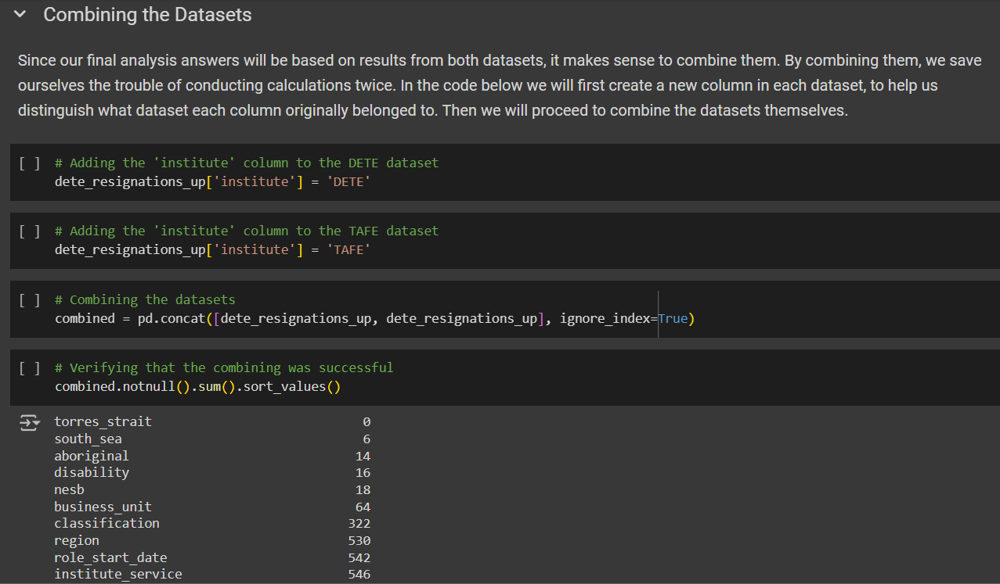

# Data Cleaning with Employee Exit Surveys

In this short project, we will be working with surveys from the [Department of Education, Training and Employment](https://en.wikipedia.org/wiki/Department_of_Education_(Queensland)) (DETE) and the [Technical and Further Education](https://en.wikipedia.org/wiki/Technical_and_further_education#Queensland) (TAFE) Institute in Queensland, Australia. DETE is a governmental organization for compulsory education, while TAFE is an umbrella organization, which overlies the nation’s colleges, or higher education institutes.

Our goal for this short project is to demonstrate deeper skills in data cleaning and how useful they can be when conducting analysis. We will not be diving into deep analysis for this project, since we want to focus more on the data cleaning. Therefore, we will only be conducting an initial analysis after our data cleaning is complete.

View this project live on Google Colab [here](https://colab.research.google.com/drive/1dF_cw9aWtN3vwq_zsoEcWjAklW2kdM5R?usp=sharing).
